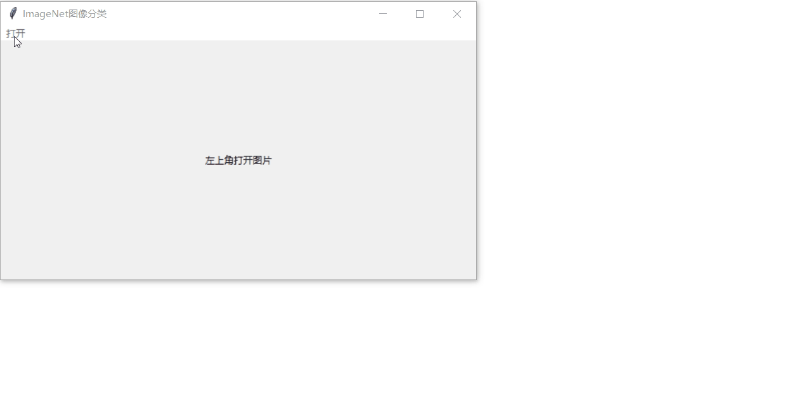

# ImageNet_Chinese_Translation

对 [ImageNet千分类标签](https://storage.googleapis.com/download.tensorflow.org/data/imagenet_class_index.json) 进行翻译

# 部分翻译

```text
tench 鲤鱼
goldfish 金鱼
great_white_shark 大白鲨
tiger_shark 虎鲨
hammerhead 锤头鲨
electric_ray 电鳐
stingray 黄貂鱼
cock 公鸡
hen 母鸡
ostrich 鸵鸟
brambling 燕雀
goldfinch 金翅雀
house_finch 家雀
junco 灯芯草雀
indigo_bunting 蓝鹀
```

# 详细查阅

[ImageNet千分类标签翻译](https://xercis.blog.csdn.net/article/details/116762753)

# 效果展示



# 参考文献

1. [ImageNet2012数据集（4d67）](https://pan.baidu.com/s/10sZPEvWKCcIpU1woCSyE8g)
2. [随风而散的翻译](https://blog.csdn.net/ll19930120/article/details/108852398)